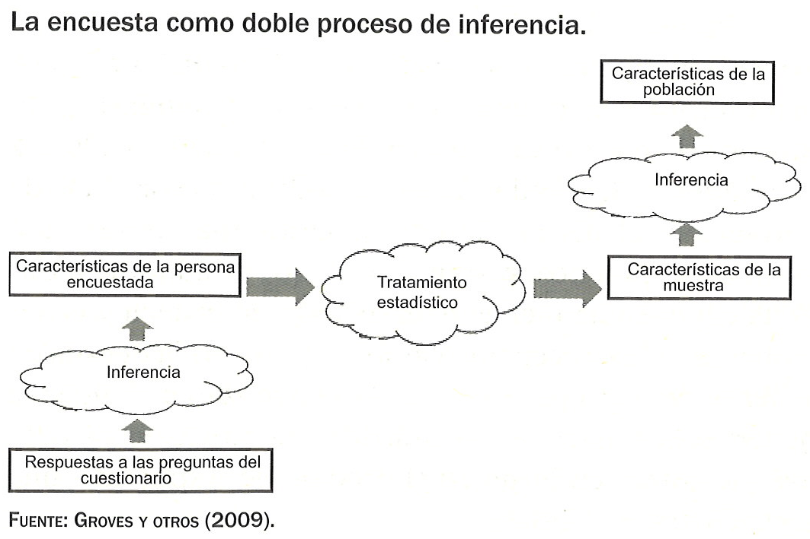
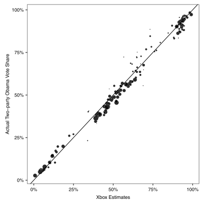

```{r xaringan-themer, include = FALSE}
options(scipen = 99999)
library(xaringanthemer)
library(tidyverse)

theme_cus <- theme(
        )

mono_light(base_color = "#23395b",
           text_font_google = google_font("Roboto"),
        code_font_google   = google_font("Droid Mono"),
        title_slide_background_image = "pics/twitter.png",
        title_slide_background_size = "4%",
        title_slide_background_position = "56.5% 55%")
```

class: inverse, center, middle

# Tenemos un problema

---
# Reino Unido, 2015


---
# La clave estaba en la representatividad
<center>

</center>
Sturgis *et al.*, 2016
---
# Es cuestión de ser, no de parecer

- Encuestas, muestreo y problemas

- Encuestas electorales y muestreo

- Análisis de representatividad

  - **Práctica**: análisis de representatividad

- Ajustes en las encuestas

- Generar un peso paso a paso con `R`

  - **Práctica**: calibrar una muestra


---
class: inverse, center, middle

# Encuestas, muestreo y problemas

---
# Doble inferencia

<center>

</center>
Font y Pasadas, 2016  
---
# Muestreo e inferencia

```{r, echo = FALSE, message=FALSE, fig.align='center'}
set.seed(123)
pop_income <- data.frame(Ingresos = rnbinom(n = 100000, size = .5, mu = 6000))
pop_income$Ingresos <- pop_income$Ingresos + abs(min(pop_income$Ingresos))+150 

ggplot(pop_income, aes(Ingresos)) +
  geom_histogram(alpha = .3) +
  geom_vline(xintercept = mean(pop_income$Ingresos), col = "red") +
  annotate("text", x = 30000, y = 30000, label = paste0("Media = ", round(mean(pop_income$Ingresos), 1), " euros"), col = "red") +
  labs(title = "Distribución de ingresos en la población") +
  theme_minimal() +
  theme(axis.title.y = element_blank()) +
  theme_cus
```

---
# Muestreo e inferencia

```{r, echo=FALSE, message=FALSE, fig.align='center', fig.width=12, fig.height=7}
samples100 <- replicate(1000, mean(sample(pop_income$Ingresos, 100)))
samples1000 <- replicate(1000, mean(sample(pop_income$Ingresos, 1000)))
samples5000 <- replicate(1000, mean(sample(pop_income$Ingresos, 5000)))
samples10000 <- replicate(1000, mean(sample(pop_income$Ingresos, 10000)))
samples <- data.frame(`n = 100` = samples100,
                      `n = 1000` = samples1000,
                      `n = 5000` = samples5000,
                      `n = 10000` = samples10000) %>%
  gather("var", "Ingresos") %>% 
  mutate(var = str_replace(var, "....", "n = "),
         var = fct_relevel(var, "n = 100", "n = 1000", "n = 5000"))

ggplot(samples, aes(Ingresos)) +
  geom_histogram(alpha = .3) +
  geom_vline(xintercept = mean(pop_income$Ingresos), col = "red") +
  facet_wrap(~ var) +
  labs(title = "Distribución de las medias de 1000 muestras") +
  theme_minimal() +
  theme(axis.title.y = element_blank()) +
  theme_cus
```


---
# Muestreo ideal (probabilístico)

- Existe un **marco muestral** en el que están listados *todos* los elementos de la población.


- El marco muestral contiene **información auxiliar** como sexo, edad o ingresos. Estas variables sonútiles para estratificar la muestra.


- Todos los elementos seleccionados en la muestra **responden** a la encuesta.


- **Procedimiento**: todos los casos tienen una probabilidad $\frac{n}{N}$ de ser elegidos. Se seleccionan $n$ casos a partir de números aleatorios.


```{r, echo = FALSE}
sf <- data.frame(Nombre = c("Fernández Fernández, Antonio", "Pérez Pérez, Clara", "González González, María"),
                 Sexo = c("H", "M", "M"),
                 Edad = c(25, 26, 47),
                 `Población` = c("Madrid", "Madrid", "Fuenlabrada"),
                 `Teléfono` = c(666534, 6663245, 9234534))

sf %>% kableExtra::kable()
```

---
# Muestreo real

.pull-left[
¿Existe en España un **marco muestral** de la población general al que tengan acceso las organizaciones de investigación social?


  - Existen registros como el **padrón de población** (INE), pero las empresas de investigación sólo pueden acceder a los datos anonimizados.

¿Todos los elementos de la muestra **responden** a la encuesta?


  - No, las tasas de respuestas en encuestas telefónicas pueden llegar a estar por debajo del 10% (Kennedy y Hartig, 2019).
]
  
--
.pull-right[
<a href="https://www.pewresearch.org/fact-tank/2019/02/27/response-rates-in-telephone-surveys-have-resumed-their-decline/ft_19-02-27_atp1_afterbriefplateau_2/"></a>
]
---
# Los problemas del muestreo probabilístico

Problemas de las **encuestas probabilísticas**:

--

- Impedimentos **técnicos**. No existe marco muestral, está incompleto o no es posible acceder. Posible sesgo provocado por la no respuesta.


- Mayor **coste** que un muestreo no probabilístico. Necesidad de extender el trabajo de campo en encuestas telefónicas y personales.


- Necesita más **tiempo** para recoger los datos. Los hogares que no responden necesitan ser contactados en diferentes horarios por un período de tiempo suficiente.

---
# Alternativas

- **Muestreo cuasiprobabilístico**: Una parte de la selección de las unidades muestrales se realiza utilizando procedimientos probabilísticos. En el último paso se utilizan cuotas para elegir a la persona entrevistada.

  - **Muestro de hogares** se realiza a partir de rutas aleatorias o de número de teléfono (fijos y móviles) generados de forma aleatoria (RDD).

  - Las **cuotas** se establecen a partir de los datos poblacionales. Se utilizan variables como sexo y edad. Cada zono geográfica tiene asignadas unas cuotas. Al finalizar el trabajo de campo el perfil de exo y edad de la muestra coincidirá con el de la población.

--

- **Muestreo no probabilístico**: No se conoce la probabilidad de selección de los elementos de la población (Baker *et al.*, 2013).

  - Encuestas por cuotas o *river sampling*. Paneles de internautas reclutados a partir de captación activa o pasiva.

  - Inferir a partir de muestras no probabilísticas. Procedimientos estadísticos o ajustes para mejorar la representatividad de la muestra e inferir.

---
# Problemas asociados a las muestras no probabilísticas

- Encuesta en un **panel online** de volunatios para conocer **intención de voto**.

--

  - Sesgo de **cobertura**. Algunos elementos de la población no tengan ninguna posibilidad de ser elegidos. Por ejemplo, una parte importante de las personas mayores de 65 años no acceden con regularidad a internet. 

--

  - Sesgo de **autoselección**. La entrada en el panel está determinada por los propios usuarios, que deciden unirse, en ocasiones porque reciben una compensación econónmica a cambio de cada encuesta completada.  

--

  - Sesgo de **no respuesta**. Todos los panelistas invitados no completarán la encuesta. Esto puede ser un problema si aquellos que contestan son diferentes que los que no responden.

---
# Problemas asociados a las muestras no probabilísticas


```{r, fig.align='center', echo=FALSE}
knitr::include_graphics("pics/pic5.png") 
```

(Elliot y Valliant, 2017)

---
class: inverse, center, middle
# Muestreo en encuestas electorales

---
# Muestreo en encuestas electorales
Las encuestas se pueden diferenciar según el modo de muestreo elegido.

- Encuesta con muestra **probabilística**: Tanto los hogares como las personas que son entrevistadas son seleccionadas utilizando métodos probabilísticos.

- Encuesta **cuasiprobabilística**: Hacen una selección probabilística del hogar y utilizan cuotas para seleccionar a la persona a entrevistar.

- Encuesta **no probabilística**: Paneles de internet o listados de números de teléfono en los que no existe una probabilidad conocida de ser incluido.

Las encuestas realizadas para el análisis político y electoral suelen ser cuasiprobabilísticas o no probabilísticas.
---
# Encuestas electorales en España

```{r, echo=FALSE}
sample_pic <- data.frame(
  `Organización` = c("CIS (Barómetros)", "CIS (ESE)", "Metroscopia", "GAD3", "IMOP insights", "40dB", "GESOP", "NC Rport", "Sociométrica"),
  `Muestreo` = c("Cuasiprobabilístico", "Probabilístico", "Probabilítico/cuasiprobabilístico", "Cuasiprobabilístico", "Cuasiprobabilístico", "No probabilístico", "Cuasiprobabilístico", "Cuasiprobabilístico", "Cuasiprobabilístico"),
  `Descripción` = c("Presencial. Selección de secciones censales de forma probabilística. Hogares con rutas aleatorias. Entrevistados por cuotas",
                    "Presencial.Selección de hogares a partir de ..",
                    "Telefónica. ",
                    "Telefónica.",
                    "Telefónica.",
                    "Panel de internautas.",
                    "Telefónica.",
                    "Telefónica.",
                    "Telefónica y panel de internautas.")
)

sample_pic %>% kableExtra::kable()

```
---
class: inverse, center, middle
# Análisis de representatividad

---
# La información de la ficha técnica

Estudiar **ficha técnica** de la encuesta:

- **Modo** de administración $\rightarrow$ Problemas de cobertura o respuesta
  - Encuesta **telefónica**: Móviles o fijos, generación aleatoria de números.
  - Encuesta **panel de internautas**: Tipo de captación.  

--
  
- Detalles del **muestreo** $\rightarrow$ Tipo de muestreo
  
--
  
- **Fechas** del trabajo de campo $\rightarrow$ Procedimientos de campo (llamadas o visitas) 

--


- **Tamaño** de la muestra $\rightarrow$ Precisión de las estimaciones (probabilística o cuasiprobabilística)

---
# Análisis de representatividad por pasos

**Comparar la distribución poblacional** de ciertas varaibles con la **muestra**:

1. **Identificar las variables** del cuestionario que son susceptibles de tener equivalentes poblacionales.
  
--

2. Encontrar la fuentes de **datos poblacionales**:
  - Registros poblacionales (INE).
  - Encuestas con altos estándares metodológicos (ESS, CIS).

--

3. Determinar la **equivalencia de los datos poblacionales**. Tener en cuenta posibles errores de medición y comparabilidad de las variables (*p. ej.* estudios).

--

4. Calcular la **diferencia** entre los datos poblaciones y las variables de la encuesta.

--

5. Calcular el **error absoluto medio** (*MAE*) de cada variable. En la que $\hat{y}$ es el porcentaje de la encuesta e $y$ el porcentaje de la misma categoría en la población. $k$ es el número de categorías de la variable.


$$\begin{aligned}
MAE = \frac{\sum{|\hat{y} - y|}}{k}
\end{aligned}$$


---
# Cálculo del MAE

```{r, echo=FALSE}
mar <- data.frame(Variable = "Grupo de edad",
                  `Categoría` = c("18-29", "30-44", "45-64", "65+"),
                  `Muestra` = c(22, 25, 23, 30),
                  `Población` = c(18, 24, 23, 35),
                  `Dif.` = c(4, 1, 0, 5)
                    )
mar %>% kableExtra::kable()
```

$$\begin{aligned}
MAE = \frac{10}{4} = 2.5
\end{aligned}$$


---

class: inverse, center, middle
# Práctica: análisis de representatividad

---

class: inverse, center, middle
# Ajustes en las encuestas

---
# Una muestra de usuarios de Xbox

.pull-left[
- En el marco de las elecciones presidenciales de 2012 en EE.UU Wang *et al.* realizaron una **encuesta (no probabilística)** a través de la plataforma de **usuarios de la Xbox**. La encuesta tuvo 345000 respuestas.

- El nivel de **desajuste era notable**: 65% de los encuestados entre 18-29 años (19% en la población). Los hombres representaban el 93% (47% en la población). Mitt Romney sobrerrepresentado.

- Ajustaron la muestra utilizando **técnicas estadísticas**. El resultado fue similar al del promedio de encuestas tradicionales.
]

--

.pull-right[
```{r, fig.align='center', echo=FALSE}
 
```
Wang *et al.*, 2015
]

---
# Pesos o ponderaciones

- Son **ajustes estadísticos** para preservar la representatividad de las muestras. Sirven para corregir desviaciones de la muestra debidas a la incidencia de los sesgos de cobertura, selección o no respuesta.

--

- A cada **caso le corresponde un peso** según sus características. El peso será más alto que la media si las características del elemento muestral están subrrepresentadas. Y serán más bajos que la media si ocurre lo contrario.

--

- Los pesos parten de un **cálculo general**:

$$\begin{aligned}
w_k = \frac{N_k}{n_k} 
\end{aligned}$$

--

- Los pesos tienen como misión corregir desviaciones de la muestra, pero también pueden tener un **efecto negativo en la varianza de las estimaciones**, que serán menos precisas.

---
background-image: url(pics/pic15.png)
background-position: 50% 50% 
background-size: 95% 
# Población

--

.pull-left[
Población de cinco  </br> **hombres** y cinco **mujeres** </br> (censo)
]

--

.pull-right[
</br>
</br>
</br>
</br>
 &nbsp;&nbsp;&nbsp;&nbsp;&nbsp;&nbsp;&nbsp;&nbsp;&nbsp;&nbsp;&nbsp;&nbsp; Investigar su **intención de </br> &nbsp;&nbsp;&nbsp;&nbsp;&nbsp;&nbsp;&nbsp;&nbsp;&nbsp;&nbsp;&nbsp;&nbsp;&nbsp;voto**
]


---
background-image: url(pics/pic16.png)
background-position: 50% 50% 
background-size: 95% 
# Población

--
.pull-left[
Población (censo): </br>
</br>
 5 (50%) **Mujeres** </br>
 5 (50%) **Hombres**
]

--

.pull-right[
</br> </br></br> </br></br> </br></br> </br></br> </br></br> </br>
&nbsp;&nbsp;&nbsp;&nbsp;&nbsp;&nbsp;&nbsp;&nbsp;&nbsp;&nbsp;&nbsp;&nbsp;&nbsp;&nbsp;&nbsp;&nbsp;&nbsp;&nbsp;&nbsp;&nbsp;&nbsp;&nbsp;&nbsp;Población (modo Dios): </br> </br>
&nbsp;&nbsp;&nbsp;&nbsp;&nbsp;&nbsp;&nbsp;&nbsp;&nbsp;&nbsp;&nbsp;&nbsp;&nbsp; &nbsp;&nbsp;&nbsp;&nbsp;&nbsp;&nbsp;&nbsp;&nbsp;&nbsp;&nbsp;&nbsp;&nbsp;&nbsp;5 (50%) **Partido A**
&nbsp;&nbsp;&nbsp;&nbsp;&nbsp;&nbsp;&nbsp;&nbsp;&nbsp;&nbsp;&nbsp;&nbsp;&nbsp;&nbsp;&nbsp;&nbsp;&nbsp;&nbsp;&nbsp;&nbsp;&nbsp;&nbsp;&nbsp;&nbsp;&nbsp;&nbsp; 5 (50%) **Partido B**
]

---
background-image: url(pics/pic17.png)
background-position: 50% 50% 
background-size: 95% 
# Incidencia de la no respuesta

--
.pull-left[
Muestra: </br>
</br>
 2 (29%) **Mujeres** </br>
 5 (71%) **Hombres**
]

--
.pull-right[
</br> </br></br> </br></br> </br></br> </br></br> </br></br> </br>
&nbsp;&nbsp;&nbsp;&nbsp;&nbsp;&nbsp;&nbsp;&nbsp;&nbsp;&nbsp;&nbsp;&nbsp;&nbsp;&nbsp;&nbsp;&nbsp;&nbsp;&nbsp;&nbsp;&nbsp;&nbsp;&nbsp;&nbsp;Muestra: </br> </br>
&nbsp;&nbsp;&nbsp;&nbsp;&nbsp;&nbsp;&nbsp;&nbsp;&nbsp;&nbsp;&nbsp;&nbsp;&nbsp; &nbsp;&nbsp;&nbsp;&nbsp;&nbsp;&nbsp;&nbsp;&nbsp;&nbsp;&nbsp;&nbsp;&nbsp;&nbsp;2 (29%) **Partido A**
&nbsp;&nbsp;&nbsp;&nbsp;&nbsp;&nbsp;&nbsp;&nbsp;&nbsp;&nbsp;&nbsp;&nbsp;&nbsp;&nbsp;&nbsp;&nbsp;&nbsp;&nbsp;&nbsp;&nbsp;&nbsp;&nbsp;&nbsp;&nbsp;&nbsp;&nbsp; 5 (71%) **Partido B**
]


---
background-image: url(pics/pic17.png)
background-position: 50% 50% 
background-size: 95% 
# Ponderación de no respuesta

--
.pull-left[
</br> </br>
Ponderación como: </br> </br>
&nbsp;&nbsp;&nbsp;&nbsp;&nbsp;&nbsp;&nbsp;&nbsp;&nbsp;&nbsp;&nbsp;&nbsp; $w_k = \frac{N_k}{n_k}$

Para las **mujeres**: </br> </br>
&nbsp;&nbsp;&nbsp;&nbsp;&nbsp;&nbsp;&nbsp;&nbsp;&nbsp;&nbsp;&nbsp;&nbsp; $w_m = \frac{5}{2} = 2.5$

Para los **hombres**: </br> </br>
&nbsp;&nbsp;&nbsp;&nbsp;&nbsp;&nbsp;&nbsp;&nbsp;&nbsp;&nbsp;&nbsp;&nbsp; $w_h = \frac{5}{5} = 1.0$
]

--

.pull-right[
</br> </br></br> </br>
&nbsp;&nbsp;&nbsp;&nbsp;&nbsp;&nbsp;&nbsp;&nbsp;&nbsp;&nbsp;&nbsp;&nbsp;&nbsp;&nbsp;&nbsp;&nbsp;&nbsp;&nbsp;&nbsp;&nbsp;&nbsp;&nbsp;&nbsp; Estimar voto con </br> &nbsp;&nbsp;&nbsp;&nbsp;&nbsp;&nbsp;&nbsp;&nbsp;&nbsp;&nbsp;&nbsp;&nbsp;&nbsp;&nbsp;&nbsp;&nbsp;&nbsp;&nbsp;&nbsp;&nbsp;&nbsp;&nbsp;&nbsp; **pesos**: 
</br> </br>

&nbsp;&nbsp;&nbsp;&nbsp;&nbsp;&nbsp;&nbsp;&nbsp;&nbsp;&nbsp;&nbsp;&nbsp;&nbsp;&nbsp;&nbsp;&nbsp;&nbsp;&nbsp;&nbsp;&nbsp;&nbsp;&nbsp;&nbsp;**M - A**: $2*2.5 = 5$ (50%)  </br>
&nbsp;&nbsp;&nbsp;&nbsp;&nbsp;&nbsp;&nbsp;&nbsp;&nbsp;&nbsp;&nbsp;&nbsp;&nbsp;&nbsp;&nbsp;&nbsp;&nbsp;&nbsp;&nbsp;&nbsp;&nbsp;&nbsp;&nbsp;**H - B**: $5*1.0 = 5$ (50%)   </br>
]

---
# ¿Qué es necesario para que un peso funcione?

- Un peso funciona cuando la varaible auxiliar que se utiliza para generarlo está correlacionada con la probabilidad de responder y con la varaible de interés. En el ejemplo:

  - Sexo (variable auxiliar) estaba relacionado con la probabilidad de responder (H=100%; M=40%).
  
  - Sexo (variable auxiliar) correlacionaba de manera perfecta con el partido a votar (variable de interés).

--

- El rol fundamental de las **variables auxiliar**. Estas variables es información que existe para los que responden y los que no responden.

  - Puede ser a nivel individual (marco muestral) o a nivel agregado (totales poblacionales).
  
  - La información auxiliar disponible es limitada (INE, otras encuestas) lo que condiciona la capacidad de los ajustes.
  
  - Pensar teóricamente qué variables pueden explicar mejor la probabilidad de responder y la variable de interés.

---
# Tipos de pesos


---
# Pesos de selección

- Se utilizan en encuestas cuando las **probabilidades de selección de los grupos son diferentes** debido al muestreo. Por ejemplo, cuando en una encuesta a población general en España una comunidad autónoma está sobrerrepresentada en la muestra para realizar análisis específico en la submuestra de la comunidad.

- Implica que en la **fase de muestreo** se ha sobrerrepresnetado a uno o más grupos de forma consciente. También se computan para ajustar las probabilidades de selección dentro de hogares o conglomerados de tamaño desigual.

- **Necesario**: Este peso se calcula a través de las probabilidades de selección. Es necesario conocer, al menos, el total de casos de cada grupo de la población.

```{r, echo=FALSE}
df <- data.frame(
  Grupo = c("Grupo1", "Grupo2", "Grupo3"), 
  N = c(1000, 1000, 1000),
  n = c(500, 100, 100),
  Prob_sel = c(.5, .1, .1), 
  Peso_sel = c(2, 10, 10)
)

df %>% kableExtra::kable()
```

---
# Pesos de no respuesta

- Ajustan ante la posible presencia de sesgos provocados por la **no respuesta o la falta de cobertura**.

--

- Dos formas de calcularlos **determinista** o **probabilística**. En la forma determinista se vuelve a realizar en cálculo de $\frac{N_k}{n_k}$. 

- En el método probabilístico se realiza un **modleo de regresión logística** en el que la varialbe dependiente es la respuesta y las variables independientes son las variables auxiliares. A partir del modelo se predice la probabilidad de responder de cada caso. El inverso de esa probabilidad es el peso. 

--

- **Necesario**: En el determinista vale con tener los totales poblacionales de cada grupo. En el probabilístico hay que tener **información a nivel individual de los que no responden**.


```{r, echo=FALSE}
df <- data.frame(
  Grupo = c("Grupo1", "Grupo2", "Grupo3"), 
  N = c(1000, 1000, 1000),
  n = c(500, 100, 100),
  Prob_sel = c(.5, .1, .1), 
  Peso_sel = c(2, 10, 10),
  Resp = c(250, 90, 70),
  RespXPeso_sel = c(500, 900, 900),
  Peso_nr = c(2, 1.11, 1.43)
)

df %>% kableExtra::kable()
```

---
# Postestratificación y calibración

- Se trata de **ajustes a través de modelos**. En ambos métodos los *inputs* son los datos de la encuesta y los totales poblacionales. El modelo se encarga de generar unos pesos que fuerzan a la distribución de la muestra a ser idéntica a la de la población.

--

- En la **postestratificación** se incluyen todas las interacciones entre las variables auxiliares. Por ejemplo, si se utilizan sexo y edad el modelo ajustará un peso para los hombres de 18 a 30 años y otro para las mujeres de 18 a 30 años. Una vez se aplique el peso resultante, el porcentaje de hombres de 18 a 30 en la muestra y en la población serán idénticos.

- En la **calibración** el ajuste se produce sin tener en cuenta las interacciones entre las variables. Es una técnica más flexible que la postestratificación. Aquí el porcentaje de hombres en la muestra y en la población serán idénticos una vez que se aplique el peso. Lo mismo ocurrirá con el grupo de 18 a 30 años. Sin embargo, es probable que el peso del grupo hombres de 18 a 30 en la muestra difiera de la población.

--

- **Necesario**: Los totales poblacionales de las variables por separado en la **calibración** y de los cruces de variables en la **postestratificación**.

---
# Probabilidad de participar a partir de una encuesta de referencia

- Esta técnica se usa para **equilibrar muestras no probabilísticas**. Se trata de calcular la *pseudoprobabilidad* de que un elemento de la población se haya unido al panel de internautas y haya respondido a la encuesta.

--

- Para llevarla a cabo se utiliza una **encuesta de referencia, generalmente con más calidad**, que comparte algunas variables con la encuesta no probabilística. Estas dos encuestas se unen para calcular la probabilidad de que cada caso acabe participando en la encuesta mediante el uso de una regresión logística. El inverso de esa probabilidad es el peso de ajuste.

--

- **Necesario**: Una encuesta de referencia que sea de más calidad y que comparta parte de las variables con la encuesta no probabilística.

---
# Ajuste por modelos MRP y modelos de superpoblación

- En este caso no se trata de estimar un peso, sino de a partir de un modelo ajustar la muestra y predecir el valor de la variable de interés sin sesgo.

--

- En el modelo **MRP** se realiza un modelo multinivel en el que para cada unidad geográfica se predice la variable dependiente en base a las características disponibles en la muestra y en los datos auxiliares. Las predicciones son ponderadas según las características geográficas. Se utiliza sobre todo para realizar estimaciones de voto para subgrupos o regiones.

- En el **modelo de superpoblación** se predice la variable de interés para cada caso en la población a partir de un modelo ajustado en la muestra no probabilística.

--

- **Necesario**: Totales poblacionales a nivel de subgrupo para **MRP**. Datos poblacionales a nivel individual para los **modelos de superpoblación**.

---
class: inverse, center, middle

# Generar un peso paso a paso con `R`

---
# Un ejemplo paso a paso para construir un peso en `R`

1. Generar un *data frame* de totales poblacionales.

2. Agregar los datos de la encuesta para la variable auxiliar.

3. Calcular los pesos para cada celda.

4. Unir los pesos a la encuesta, evaluar y escalar.

---
# Datos

```{r}
gss <- gss_cat %>% 
  filter(year == 2014) %>% 
  select(race, rincome)
  
glimpse(gss)
```

---
# 1. Generar un *data frame* de totales poblacionales

- Los totales poblacionales extraídos de la [*American Communiy Survey*](https://www.census.gov/acs/www/data/data-tables-and-tools/).

```{r}
totales_pobla <- data.frame(race = c("White", "Black", "Other"),
                            N = c(233963128, 40379066, 44514806))

totales_pobla
```

---
# 2. Agregar los datos de la encuesta para la variable auxiliar

- Agregar los datos de la encuesta para saber cuántos casos hay en cada grupo.

```{r}
gss_agg <- gss %>% 
  group_by(race) %>% 
  summarise(n = n())

gss_agg
```

---
# 3. Calcular los pesos para cada celda

```{r, message=FALSE}
gss_agg <- left_join(gss_agg, totales_pobla, by = "race")

gss_agg$peso <- gss_agg$N/gss_agg$n 

gss_agg
```

---
# 4. Unir los pesos a la encuesta, evaluar y escalar

```{r, message=FALSE, warning=FALSE}
gss <- left_join(gss, gss_agg, by = "race")

sjmisc::frq(gss$race)
```

---
# 4. Unir los pesos a la encuesta, evaluar y escalar

```{r, message=FALSE, warning=FALSE}
sjmisc::frq(gss$race, weights = gss$peso)
```

---
# 4. Unir los pesos a la encuesta, evaluar y escalar

```{r, message=FALSE}
sjmisc::frq(gss$rincome)
```

---
# 4. Unir los pesos a la encuesta, evaluar y escalar

```{r, message=FALSE}
sjmisc::frq(gss$rincome, weights = gss$peso)
```
---
# 4. Unir los pesos a la encuesta, evaluar y escalar

```{r, message=FALSE}
gss$peso <- gss$peso/mean(gss$peso)

sjmisc::descr(gss$peso)
```

---
# En resumen


