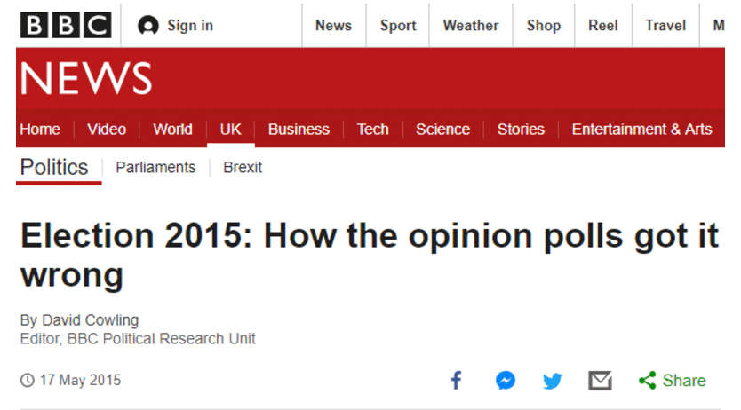
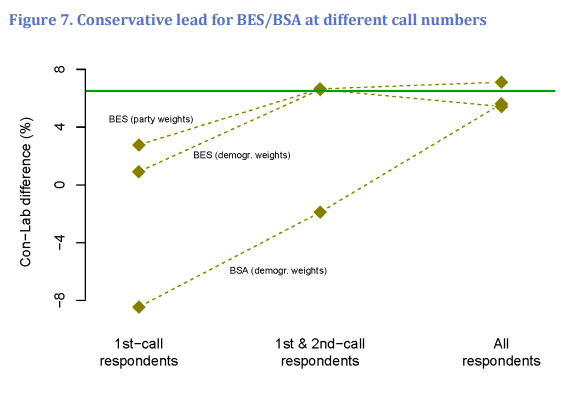
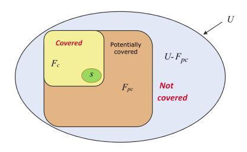

```{r xaringan-themer, include = FALSE}
options(scipen = 99999)
options(htmltools.dir.version = FALSE)
library(xaringanthemer)
library(tidyverse)
library(survey)

theme_cus <- theme(plot.background = element_rect(fill = "#E9EBEE", color = "#E9EBEE"),
                   panel.background = element_rect(fill = "#E9EBEE", color = "#E9EBEE"),
                   plot.title = element_text(color = "#23395b"),
                   plot.subtitle = element_text(color = "#23395b"),
                   axis.title = element_text(color = "#23395b"),
                   strip.text = element_text(color = "#23395b", face = "bold"),
                   panel.grid.major = element_line(color = "gray")
        )

mono_light(base_color = "#23395b",
        header_font_google = google_font("Oswald", "500"),
        text_font_google   = google_font("Roboto Slab", "400", "400i"),
        code_font_google   = google_font("IBM Plex Mono"),
        link_color = "white")
```

class: inverse, center, middle

# Tenemos un problema

---
# Reino Unido, 2015



---
# La clave estaba en la representatividad
<center>

</center>
Sturgis *et al.*, 2016
---
# Diagnosticar y ajustar

- Encuestas, muestreo y otros problemas

- Encuestas electorales y muestreo

- Análisis de representatividad

  - **Práctica**: análisis de representatividad

- Ajustes en las encuestas

- Generar un peso paso a paso con `R`

  - **Práctica**: ponderar una muestra


---
class: inverse, center, middle

# Encuestas, muestreo y otros problemas

---
background-image: url(pics/pic1.png)
background-position: 60% 70% 
background-size: 60% 
# Doble inferencia

Font y Pasadas, 2016  
---
# Muestreo e inferencia

```{r, echo = FALSE, message=FALSE, fig.align='center'}
set.seed(123)
pop_income <- data.frame(Ingresos = rnbinom(n = 100000, size = .5, mu = 6000))
pop_income$Ingresos <- pop_income$Ingresos + abs(min(pop_income$Ingresos))+150 

ggplot(pop_income, aes(Ingresos)) +
  geom_histogram(alpha = .3, fill = "#23395b") +
  geom_vline(xintercept = mean(pop_income$Ingresos), col = "red") +
  annotate("text", x = 30000, y = 42000, label = paste0("Media = ", round(mean(pop_income$Ingresos), 1), " euros"), col = "red") +
  labs(title = "Distribución de ingresos en la población (N = 100000)") +
  theme_minimal() +
  theme(axis.title.y = element_blank(),
        title = element_text(face = "bold")) +
  theme_cus
```

---
# Muestreo e inferencia

```{r, echo=FALSE, message=FALSE, fig.align='center', fig.width=12, fig.height=7}

mean_se <- function(data, n){
  
  samp <- sample(data, n, replace = F)
  
   mn <- mean(samp)
   se <- sqrt(var(samp)/length(samp))
   
  return_df <-  data.frame(n = n,
                           var = paste0("n = ", n),
              Ingresos = mn,
              se = se,
              lmoe95 = mn-1.96*se,
              umoe95 = mn+1.96*se)
  
  return_df
}

n_vec <- c(rep(100, 1000), rep(1000, 1000), rep(5000, 1000), rep(10000, 1000))

samples <- map_df(n_vec, ~mean_se(data = pop_income$Ingresos, n = .x))

ggplot(samples, aes(Ingresos)) +
  geom_histogram(alpha = .3, fill = "#23395b") +
  geom_vline(xintercept = mean(pop_income$Ingresos), col = "red") +
  facet_wrap(~ var) +
  labs(title = "Distribución de las medias de 1000 muestras") +
  theme_minimal() +
  theme(axis.title.y = element_blank(),
        title = element_text(size = 20, face = "bold")) +
  theme_cus
```

---
# Varianza y sesgo

.pull-left[
```{r, echo=FALSE, warning=FALSE}
samples_1k <- filter(samples, var == "n = 1000") %>% 
  rownames_to_column("id") 

ggplot(samples_1k[sample(nrow(samples_1k), 20),], aes(x = Ingresos, y = id)) +
  geom_vline(xintercept = mean(pop_income$Ingresos), col = "red") +
  geom_point(size = 3, col = "#23395b") +
  geom_errorbarh(aes(xmin = lmoe95, xmax = umoe95), col = "#23395b") +
  annotate("text", x = 6500, y = 20.2, label = paste0("Media poblacional"), col = "red") +
  scale_x_continuous(limits = c(4500, 7500))+
  labs(title = "Varianza",
  subtitle = "IC 95% · 20 muestras n=1000") +
  theme_minimal() +
  theme(axis.title.y = element_blank(),
        title = element_text(size = 15, face = "bold"),
        axis.text.y = element_blank(),
        panel.grid.major.y = element_blank()) +
  theme_cus
```
]

--

.pull-right[
```{r, echo=FALSE, message=FALSE, warning=FALSE}
samples_1k_bias <- filter(samples, var == "n = 10000") %>% 
  rownames_to_column("id") %>% 
  mutate(Ingresos = Ingresos + 400,
         lmoe95 = lmoe95 + 400,
         umoe95 = umoe95 + 400)

ggplot(samples_1k_bias[sample(nrow(samples_1k_bias), 20),], aes(x = Ingresos, y = id)) +
  geom_vline(xintercept = mean(pop_income$Ingresos), col = "red") +
  geom_point(size = 3, col = "#23395b") +
  geom_errorbarh(aes(xmin = lmoe95, xmax = umoe95), col = "#23395b") +
  annotate("text", x = 6500, y = 20.2, label = paste0("Media poblacional"), col = "red") +
  labs(title = "Sesgo",
  subtitle = "IC 95% · 20 muestras n=10000") +
  scale_x_continuous(limits = c(4500, 7500))+
  theme_minimal() +
  theme(axis.title.y = element_blank(),
        title = element_text(size = 15, face = "bold"),
        axis.text.y = element_blank(),
        panel.grid.major.y = element_blank()) +
  theme_cus
```
]

---
# Muestreo ideal (probabilístico)

- Existe un **marco muestral** en el que están listados *todos* los elementos de la población.

--

- El marco muestral contiene **información auxiliar** como sexo, edad o ingresos. Estas variables son útiles para estratificar la muestra.

--

- Todos los elementos seleccionados en la muestra **responden** a la encuesta.

--

- **Procedimiento**: todos los casos tienen una probabilidad $\frac{n}{N}$ de ser elegidos. Se seleccionan $n$ casos a partir de números aleatorios.

--

```{r, echo = FALSE}
sf <- data.frame(Nombre = c("Fernández Fernández, Antonio", "Pérez Pérez, Clara", "González González, María"),
                 Sexo = c("H", "M", "M"),
                 Edad = c(25, 26, 47),
                 `Población` = c("Madrid", "Madrid", "Fuenlabrada"),
                 `Teléfono` = c(666534, 6663245, 9234534))

sf %>% kableExtra::kable()
```

---
# Muestreo real

.pull-left[
¿Existe en España un **marco muestral** de la población general al que tengan acceso las organizaciones dedicadas a la investigación social?
]

---
# Muestreo real

.pull-left[
¿Existe en España un **marco muestral** de la población general al que tengan acceso las organizaciones dedicadas a la investigación social?


  - Existen registros como el **padrón de población** (INE), pero las empresas de investigación sólo pueden acceder a los datos anonimizados.
]

---
# Muestreo real

.pull-left[
¿Existe en España un **marco muestral** de la población general al que tengan acceso las organizaciones dedicadas a la investigación social?


  - Existen registros como el **padrón de población** (INE), pero las empresas de investigación sólo pueden acceder a los datos anonimizados.

¿Todos los elementos de la muestra **responden** a la encuesta?
]


---
# Muestreo real

.pull-left[
¿Existe en España un **marco muestral** de la población general al que tengan acceso las organizaciones dedicadas a la investigación social?


  - Existen registros como el **padrón de población** (INE), pero las empresas de investigación sólo pueden acceder a los datos anonimizados.

¿Todos los elementos de la muestra **responden** a la encuesta?


  - No, las tasas de respuestas en encuestas telefónicas pueden llegar a estar **por debajo del 10%** (Kennedy y Hartig, 2019).
]
  
--
.pull-right[
<a href="https://www.pewresearch.org/fact-tank/2019/02/27/response-rates-in-telephone-surveys-have-resumed-their-decline/ft_19-02-27_atp1_afterbriefplateau_2/"></a>
]
---
# Los problemas del muestreo probabilístico

Problemas de las **encuestas probabilísticas**:

--

- Impedimentos **técnicos**. No existe marco muestral, está incompleto o no es posible acceder. Posible sesgo provocado por la no respuesta.


- Mayor **coste** que un muestreo no probabilístico. Necesidad de extender el trabajo de campo en encuestas telefónicas y personales.


- Necesita más **tiempo** para recoger los datos. Los hogares que no responden necesitan ser contactados en diferentes horarios por un período de tiempo suficiente.

---
# Alternativas

- **Muestreo probabilístico combinado con no probabilístico**. Una parte de la selección de las unidades muestrales se realiza utilizando procedimientos probabilísticos. En el último paso se utilizan cuotas para elegir a la persona entrevistada.

  - **Muestro de hogares** se realiza a partir de rutas aleatorias o de número de teléfono (fijos y móviles) generados de forma aleatoria (RDD).

  - Las **cuotas** se establecen a partir de los datos poblacionales. Se utilizan variables como sexo y edad. Cada zona geográfica tiene asignadas unas cuotas. Al finalizar el trabajo de campo el perfil de sexo y edad de la muestra coincidirá con el de la población.

--

- **Muestreo no probabilístico**. No se conoce la probabilidad de selección de los elementos de la población (Baker *et al.*, 2013).

  - Encuestas por **cuotas o *river sampling***. Paneles de internautas reclutados a partir de captación activa o pasiva.

  - **Inferir a partir de muestras no probabilísticas**. Procedimientos estadísticos o ajustes para mejorar la representatividad de la muestra e inferir.

---
# Problemas asociados a las muestras no probabilísticas

- Encuesta a partir de un **panel online** de volunatios para conocer **intención de voto** de la población general.
    
--

  - Sesgo de **cobertura**. Algunos elementos de la población no tienen ninguna posibilidad de ser elegidos. Por ejemplo, una parte importante de las personas mayores de 65 años no acceden con regularidad a internet. Este problema también puede afectar a las muestras  probabilísticas.

--

  - Sesgo de **autoselección**. La entrada en el panel está determinada por los propios usuarios, que deciden unirse, en ocasiones porque reciben una compensación econónmica a cambio de cada encuesta completada.  

--
  
  - Sesgo de **no respuesta**. Todos los panelistas invitados no completarán la encuesta. Esto puede ser un problema si aquellos que contestan son diferentes que los que no responden. Este problema también afecta a las muestras probabilísticas.

---
# Problemas asociados a las muestras no probabilísticas

```{r, fig.align='center', echo=FALSE}
 
```

Elliot y Valliant, 2017

---
class: inverse, center, middle
# Muestreo en encuestas electorales

---
# Muestreo en encuestas electorales
Las encuestas se pueden diferenciar según el modo de muestreo elegido.

- Las encuestas realizadas para el análisis político y electoral suelen partir de **muestras probabilísticas/no probabilísticas o no probabilísticas**. Se ha demostrado que algunas muestras no probabilísticas han sido más precisas al estimar el resultado electoral (Baker *et al.*, 2013).

--

- En España las encuesta **telefónicas utilizan cuotas de sexo y edad**. Desde hace unos años algunas empresas han dejado el sistema de cuotas. Algunas encuestas de panel online utilizan **cuotas más exhaustivas**.

--

- En algunas encuestas telefónicas se especifica el **uso de teléfonos fijos y móviles**. En otros casos no se conoce.

--

- El muestreo suele estar **estratificado por comunidad y tamaño de hábitat**. En algunas encuestas telefónicas se utiliza el municipio como punto muestral.

---
# Encuestas electorales en España

```{r, echo=FALSE}
sample_pic <- data.frame(
  `Organización` = c("CIS (Barómetros)", "CIS (ESE)", "Metroscopia", "GAD3", "IMOP insights", "40dB", "GESOP", "NC Rport", "Sociométrica"),
  `Muestreo` = c("Prob./No prob.", "Probabilístico", "Prob./No prob.", "Prob./No prob.", "Prob./No prob.", "Prob./No prob.", "Prob./No prob.", "Prob./No prob.", "Prob./No prob."),
  `Descripción` = c("Presencial. Selección de secciones censales de forma probabilística. Hogares con rutas aleatorias. Entrevistados por cuotas sexo y edad.",
                    "Presencial. Selección de personas directamente del padrón.",
                    "Telefónica (móviles). Muestra aleatoria de teléfonos. Sin cuotas.",
                    "Telefónica (fijos y móviles). Cuotas sexo, edad y región.",
                    "Telefónica (fijos 55% y móviles 45%). Muestra aleatoria de teléfonos sin cuotas.",
                    "Panel de internautas. Cuotas de sexo, edad, clase social, región y tamaño de hábitat.",
                    "Telefónica. Cuotas de sexo y edad.",
                    "Telefónica. Cuotas de sexo y edad.",
                    "Telefónica y panel de internautas. Cuotas sexo, edad y provincia.")
)

sample_pic[1:4,] %>% kableExtra::kable()
```
---
# Encuestas electorales en España

```{r, echo=FALSE}
sample_pic <- sample_pic %>% filter(`Organización` %in% c("IMOP insights", "40dB", "GESOP", "NC Rport", "Sociométrica"))
sample_pic %>% kableExtra::kable()
```
---
class: inverse, center, middle
# Análisis de representatividad

---
# La información de la ficha técnica

Estudiar **ficha técnica** de la encuesta:

- **Modo** de administración $\rightarrow$ Problemas de cobertura o respuesta.

  - Encuesta **telefónica**: móviles o fijos, generación aleatoria de números.
  - Encuesta **panel de internautas**: tipo de captación.  

--
  
- Detalles del **muestreo** $\rightarrow$ Tipo de muestreo (variables que han tenido en cuenta en el diseño).
  
--
  
- **Fechas** del trabajo de campo $\rightarrow$ Procedimientos de campo (llamadas o visitas). 

--

- **Tamaño** de la muestra y margen de error $\rightarrow$ Precisión de las estimaciones (probabilística o cuasiprobabilística).

---
# Análisis de representatividad por pasos

**Comparar la distribución poblacional** de ciertas varaibles con la **muestra**:

1. **Identificar las variables** del cuestionario que son susceptibles de tener equivalentes poblacionales.
  
--

2. Encontrar la fuentes de **datos poblacionales**:
  - Registros poblacionales (INE).
  - Encuestas con altos estándares metodológicos (ESE, CIS).

--

3. Determinar la **equivalencia de los datos poblacionales**. Tener en cuenta posibles errores de medición y comparabilidad de las variables (*p. ej.* estudios).

--

4. Calcular la **diferencia** entre las distribuciones de los datos poblaciones y las variables de la encuesta.

--

5. Calcular el **error absoluto medio** (*MAE*) de cada variable. En la que $\hat{y}$ es el porcentaje de la categoría en la encuesta e $y$ el porcentaje en la población. $k$ es el número de categorías de la variable.


$$\begin{aligned}
MAE = \frac{\sum{|\hat{y} - y|}}{k}
\end{aligned}$$


---
# Cálculo del MAE

```{r, echo=FALSE}
mar <- data.frame(Variable = "Grupo de edad",
                  `Categoría` = c("18-29", "30-44", "45-64", "65+"),
                  `Muestra` = c(22, 25, 23, 30),
                  `Población` = c(18, 24, 23, 35),
                  `Dif.` = c(4, 1, 0, 5)
                    )
mar %>% kableExtra::kable()
```

$$\begin{aligned}
MAE = \frac{10}{4} = 2.5
\end{aligned}$$


---

class: inverse, center, middle
# Práctica: análisis de representatividad

---

class: inverse, center, middle
# Ajustes en las encuestas

---
# Una muestra de usuarios de Xbox

.pull-left[
- En el marco de las elecciones presidenciales de 2012 en EE.UU Wang *et al.* realizaron una **encuesta (no probabilística)** a través de la plataforma de **usuarios de la Xbox**. La encuesta tuvo 345000 respuestas.
]

---
# Una muestra de usuarios de Xbox

.pull-left[
- En el marco de las elecciones presidenciales de 2012 en EE.UU Wang *et al.* realizaron una **encuesta (no probabilística)** a través de la plataforma de **usuarios de la Xbox**. La encuesta tuvo 345000 respuestas.

- El nivel de **desajuste era notable**: 65% de los encuestados entre 18-29 años (19% en la población). Los hombres representaban el 93% (47% en la población). Mitt Romney sobrerrepresentado.
]

---
# Una muestra de usuarios de Xbox

.pull-left[
- En el marco de las elecciones presidenciales de 2012 en EE.UU Wang *et al.* realizaron una **encuesta (no probabilística)** a través de la plataforma de **usuarios de la Xbox**. La encuesta tuvo 345000 respuestas.

- El nivel de **desajuste era notable**: 65% de los encuestados entre 18-29 años (19% en la población). Los hombres representaban el 93% (47% en la población). Mitt Romney sobrerrepresentado.

- Ajustaron la muestra utilizando **técnicas estadísticas**. El resultado fue similar al del promedio de encuestas tradicionales.
]

--

.pull-right[
```{r, fig.align='center', echo=FALSE}
knitr::include_graphics("pics/pic4.png", dpi = 100) 
```
Wang *et al.*, 2015
]

---
# Pesos o ponderaciones

- Son **ajustes estadísticos** para preservar la representatividad de la muestra. Sirven para corregir desviaciones de la muestra debidas a la incidencia de los sesgos de cobertura, selección o no respuesta.

--

- A cada **caso le corresponde un peso** según sus características. El peso será más alto que la media si las características del elemento muestral están subrrepresentadas en la muestra.

--

- Los pesos parten de un **cálculo general**:

$$\begin{aligned}
w_k = \frac{N_k}{n_k} 
\end{aligned}$$

--

- Los pesos tienen como misión corregir desviaciones de la muestra, pero también pueden tener un **efecto negativo en la varianza de las estimaciones**, que serán menos precisas.

--

- Algunas encuestas como la ESE **ofrecen pesos** en los datos que hacen públicos para que sean utilizados en los análisis.

---
background-image: url(pics/pic15.png)
background-position: 50% 50% 
background-size: 70% 
# Población

--

.pull-left[
Población de cinco  </br> **hombres** y cinco **mujeres** </br> (censo)
]

--

.pull-right[
</br>
</br>
</br>
</br>
 &nbsp;&nbsp;&nbsp;&nbsp;&nbsp;&nbsp;&nbsp;&nbsp;&nbsp;&nbsp;&nbsp;&nbsp;&nbsp;&nbsp;&nbsp;&nbsp;&nbsp;&nbsp; Investigar su **intención de </br> &nbsp;&nbsp;&nbsp;&nbsp;&nbsp;&nbsp;&nbsp;&nbsp;&nbsp;&nbsp;&nbsp;&nbsp;&nbsp;&nbsp;&nbsp;&nbsp;&nbsp;&nbsp;&nbsp;voto**
]


---
background-image: url(pics/pic16.png)
background-position: 50% 50% 
background-size: 70% 
# Población

--
.pull-left[
Población (censo): </br>
</br>
 5 (50%) **Mujeres** </br>
 5 (50%) **Hombres**
]

--

.pull-right[
</br> </br></br> </br></br> </br></br> </br></br> </br></br> </br>
&nbsp;&nbsp;&nbsp;&nbsp;&nbsp;&nbsp;&nbsp;&nbsp;&nbsp;&nbsp;&nbsp;&nbsp;&nbsp;&nbsp;&nbsp;&nbsp;&nbsp;&nbsp;&nbsp;&nbsp;&nbsp;&nbsp;&nbsp;Población (modo Dios): </br> </br>
&nbsp;&nbsp;&nbsp;&nbsp;&nbsp;&nbsp;&nbsp;&nbsp;&nbsp;&nbsp;&nbsp;&nbsp;&nbsp; &nbsp;&nbsp;&nbsp;&nbsp;&nbsp;&nbsp;&nbsp;&nbsp;&nbsp;&nbsp;&nbsp;&nbsp;&nbsp;5 (50%) **Partido A**</br>
&nbsp;&nbsp;&nbsp;&nbsp;&nbsp;&nbsp;&nbsp;&nbsp;&nbsp;&nbsp;&nbsp;&nbsp;&nbsp;&nbsp;&nbsp;&nbsp;&nbsp;&nbsp;&nbsp;&nbsp;&nbsp;&nbsp;&nbsp;&nbsp;&nbsp;&nbsp; 5 (50%) **Partido B**
]

---
background-image: url(pics/pic17.png)
background-position: 50% 50% 
background-size: 70% 
# Incidencia de la no respuesta

--
.pull-left[
Muestra final: </br>
</br>
 2 (29%) **Mujeres** </br>
 5 (71%) **Hombres**
]

--
.pull-right[
</br> </br></br> </br></br> </br></br> </br></br> </br></br> </br>
&nbsp;&nbsp;&nbsp;&nbsp;&nbsp;&nbsp;&nbsp;&nbsp;&nbsp;&nbsp;&nbsp;&nbsp;&nbsp;&nbsp;&nbsp;&nbsp;&nbsp;&nbsp;&nbsp;&nbsp;&nbsp;&nbsp;&nbsp;Muestra final: </br> </br>
&nbsp;&nbsp;&nbsp;&nbsp;&nbsp;&nbsp;&nbsp;&nbsp;&nbsp;&nbsp;&nbsp;&nbsp;&nbsp; &nbsp;&nbsp;&nbsp;&nbsp;&nbsp;&nbsp;&nbsp;&nbsp;&nbsp;&nbsp;&nbsp;&nbsp;&nbsp;2 (29%) **Partido A**</br>
&nbsp;&nbsp;&nbsp;&nbsp;&nbsp;&nbsp;&nbsp;&nbsp;&nbsp;&nbsp;&nbsp;&nbsp;&nbsp;&nbsp;&nbsp;&nbsp;&nbsp;&nbsp;&nbsp;&nbsp;&nbsp;&nbsp;&nbsp;&nbsp;&nbsp;&nbsp; 5 (71%) **Partido B**
]


---
background-image: url(pics/pic17.png)
background-position: 50% 50% 
background-size: 70% 
# Ponderación

--
.pull-left[
</br> </br>
Ponderación como: </br> </br>
&nbsp;&nbsp;&nbsp;&nbsp;&nbsp;&nbsp;&nbsp;&nbsp;&nbsp;&nbsp;&nbsp;&nbsp; $w_k = \frac{N_k}{n_k}$

Para las **mujeres**: </br> </br>
&nbsp;&nbsp;&nbsp;&nbsp;&nbsp;&nbsp;&nbsp;&nbsp;&nbsp;&nbsp;&nbsp;&nbsp; $w_m = \frac{5}{2} = 2.5$

Para los **hombres**: </br> </br>
&nbsp;&nbsp;&nbsp;&nbsp;&nbsp;&nbsp;&nbsp;&nbsp;&nbsp;&nbsp;&nbsp;&nbsp; $w_h = \frac{5}{5} = 1.0$
]

--

.pull-right[
</br> </br></br> </br>
&nbsp;&nbsp;&nbsp;&nbsp;&nbsp;&nbsp;&nbsp;&nbsp;&nbsp;&nbsp;&nbsp;&nbsp;&nbsp;&nbsp;&nbsp;&nbsp;&nbsp;&nbsp;&nbsp;&nbsp;&nbsp;&nbsp;&nbsp; Estimar voto con </br> &nbsp;&nbsp;&nbsp;&nbsp;&nbsp;&nbsp;&nbsp;&nbsp;&nbsp;&nbsp;&nbsp;&nbsp;&nbsp;&nbsp;&nbsp;&nbsp;&nbsp;&nbsp;&nbsp;&nbsp;&nbsp;&nbsp;&nbsp; **pesos**: 
</br> </br>

&nbsp;&nbsp;&nbsp;&nbsp;&nbsp;&nbsp;&nbsp;&nbsp;&nbsp;&nbsp;&nbsp;&nbsp;&nbsp;&nbsp;&nbsp;&nbsp;&nbsp;&nbsp;&nbsp;&nbsp;&nbsp;&nbsp;&nbsp;**Mujeres - Partido A**: $2*2.5 = 5$ (50%)  </br>
&nbsp;&nbsp;&nbsp;&nbsp;&nbsp;&nbsp;&nbsp;&nbsp;&nbsp;&nbsp;&nbsp;&nbsp;&nbsp;&nbsp;&nbsp;&nbsp;&nbsp;&nbsp;&nbsp;&nbsp;&nbsp;&nbsp;&nbsp;**Mujeres - Partido B**: $0*2.5 = 0$ (0%)  </br></br>
&nbsp;&nbsp;&nbsp;&nbsp;&nbsp;&nbsp;&nbsp;&nbsp;&nbsp;&nbsp;&nbsp;&nbsp;&nbsp;&nbsp;&nbsp;&nbsp;&nbsp;&nbsp;&nbsp;&nbsp;&nbsp;&nbsp;&nbsp;**Hombres - Partido A**: $0*1.0 = 0$ (0%)   </br>
&nbsp;&nbsp;&nbsp;&nbsp;&nbsp;&nbsp;&nbsp;&nbsp;&nbsp;&nbsp;&nbsp;&nbsp;&nbsp;&nbsp;&nbsp;&nbsp;&nbsp;&nbsp;&nbsp;&nbsp;&nbsp;&nbsp;&nbsp;**Hombres - Partido B**: $5*1.0 = 5$ (50%)   </br>
]

---
# ¿Qué es necesario para que un peso funcione?

- Un peso funciona cuando la **variable auxiliar** que se utiliza para generarlo está **correlacionada con la probabilidad de responder y con la varaible de interés**. En el ejemplo:

  - Sexo (variable auxiliar) estaba relacionado con la probabilidad de responder (H=100%; M=40%).
  
  - Sexo (variable auxiliar) correlacionaba de manera perfecta con el partido a votar (variable de interés).

--

- Las **variables auxiliares**. Estas variables son información que existe para los que participan en la encuesta y para los que no.

  - Puede ser a nivel **individual** (marco muestral) o a nivel **agregado** (totales poblacionales).
  
  - La información auxiliar disponible es **limitada** (INE, otras encuestas), lo que condiciona la capacidad de los ajustes.
  
  - Pensar **teóricamente** qué variables pueden explicar mejor la **probabilidad de responder** y la **variable de interés**.

---
# Tipos de ajustes

Según la función y la manera de generarlos hay diferentes tipos de pesos:

- Pesos de **selección**.

- Pesos de **no respuesta**.

- Pseudopesos a partir de una **encuesta de referencia**.

- Ajuste por modelos **MRP** o **superpoblación**.

- **Postestratificación** y **calibración**.
---
# Pesos de selección

- Se utilizan en encuestas cuando las **probabilidades de selección de los grupos son diferentes** debido al muestreo. También se computan para ajustar las probabilidades de selección dentro de hogares o conglomerados de tamaño desigual.

  - Por ejemplo, cuando en una encuesta a población general en España una comunidad autónoma está sobrerrepresentada.

--

- **Necesario** $\rightarrow$ Este peso se calcula a través de las probabilidades de selección. Es necesario conocer, al menos, el total de casos de cada grupo de la población.

--

```{r, echo=FALSE}
df <- data.frame(
  Grupo = c("Grupo1", "Grupo2", "Grupo3"), 
  N = c(1000, 1000, 1000),
  n = c(500, 100, 100),
  Prob_sel = c(.5, .1, .1), 
  Peso_sel = c(2, 10, 10)
)

df %>% kableExtra::kable()
```

---
# Pesos de no respuesta

- Ajustan ante la pérdida de representatividad debido a la **no respuesta o la falta de cobertura**. Dos formas de calcularlos **determinista** o **probabilística**.

--

- En la forma **determinista** o *cell-weighting* se vuelve a realizar en cálculo de $\frac{N_k}{n_k}$. 

--

- En el método **probabilístico** se realiza un **modelo de regresión logística** en el que la variable dependiente es la respuesta y las variables independientes son las variables auxiliares. A partir del modelo se predice la probabilidad de responder a la encuesta de cada caso. El inverso de esa probabilidad es el peso. 

--

- **Necesario** $\rightarrow$ En el determinista es suficiente con tener los totales poblacionales de cada grupo. En el probabilístico hay que tener **información a nivel individual de los que no responden**.


```{r, echo=FALSE}
df <- data.frame(
  Grupo = c("Grupo1", "Grupo2", "Grupo3"), 
  N = c(1000, 1000, 1000),
  n = c(500, 100, 100),
  Prob_sel = c(.5, .1, .1), 
  Peso_sel = c(2, 10, 10),
  Resp = c(250, 90, 70),
  RespXPeso_sel = c(500, 900, 900),
  Peso_nr = c(2, 1.11, 1.43),
  Peso_final = c(4, 11.1, 14.3)
)

df %>% kableExtra::kable()
```

---
# Pseudopesos a partir de una encuesta de referencia

- Esta técnica se usa para **equilibrar muestras no probabilísticas**. Se trata de calcular la *pseudoprobabilidad* de que un elemento de la población se haya unido al panel de internautas y haya respondido a la encuesta.

--

- Para llevarla a cabo se utiliza una **encuesta de referencia** con estándares metodológicos más altos, que comparta algunas variables con la encuesta no probabilística. Estas dos encuestas se unen para **calcular la probabilidad de participar** en la encuesta mediante el uso de una regresión logística. El inverso de esa probabilidad es el peso de ajuste.

--

- **Necesario** $\rightarrow$ Una encuesta de referencia que sea de más calidad y que comparta parte de las variables con la encuesta no probabilística. Las variables compartidas deben explicar el mecanismo de participación.

---
# Ajuste por modelos MRP y superpoblación

- En este caso no se trata de estimar un peso, sino de utilizar **un modelo para ajustar la muestra y predecir el valor de la variable de interés sin sesgo**.

--

- La técnica **MRP** (*multilevel regression and poststratification*) consiste en un modelo multinivel en el que para cada subgrupo se predice la variable dependiente en base a las características disponibles en la muestra y en los datos auxiliares. Las predicciones son ponderadas según las características del subgrupo. Se utiliza sobre todo para realizar estimaciones de voto para subgrupos o regiones con muestras relativamente pequeñas.

- En el **modelo de superpoblación** se predice la variable de interés para cada caso en la población a partir de un modelo ajustado en la muestra no probabilística.

--

- **Necesario** $\rightarrow$ Totales poblacionales a nivel de subgrupo para **MRP**. Datos poblacionales a nivel individual para los **modelos de superpoblación**.

---
# Postestratificación y calibración

- Se trata de **ajustes a través de modelos**. En ambos métodos los *inputs* son los datos de la encuesta y los totales poblacionales. El modelo se encarga de generar unos pesos que fuerzan a la distribución de la muestra a ser idéntica a la de la población.

--

- En la **postestratificación** se incluyen todas las interacciones entre las variables auxiliares. 

- En la **calibración** el ajuste se produce sin tener en cuenta las interacciones entre las variables. Es una técnica más flexible que la postestratificación. 

--

- **Necesario** $\rightarrow$ Los totales poblacionales de las variables por separado en la **calibración** y de los cruces de variables en la **postestratificación**.

---
background-image: url(pics/pic7.png)
background-position: 50% 50% 
background-size: 60% 
# Esquema de la calibración


---
background-image: url(pics/pic8.png)
background-position: 50% 85% 
background-size: 35% 
# La diferencia entre postestratificación y calibración

- Se realiza una **calibración** y **postestratificación** utilizando las variables sexo y edad en grupos.

---
background-image: url(pics/pic9.png)
background-position: 50% 70% 
background-size: 35% 
# La diferencia entre postestratificación y calibración


---
class: inverse, center, middle

# Generar un peso paso a paso con [`r icon::fa("r-project")`]()

---
# Un ejemplo paso a paso para construir un peso en `r icon::fa("r-project")`

Para calcular el peso por calibración vamos a utilizar el paquete `survey`. Para la manipulación de datos `tidyverse`.

1. Generar un `vector` con nombres de **totales poblacionales**.

2. Preparar las **variables auxiliares** en la encuesta y el **peso inicial**.

3. Calcular los pesos mediante **calibración**.

4. **Evaluar** la calibración.

5. **Escalar** los pesos para que tengan media 1.

---
# Datos

- Utilizo los datos gss_cat de `tidyverse` para ponderar la muestra utilizando la variable `race` y ajustar la estimación de `partyid`.

```{r}
gss <- gss_cat %>% 
  filter(year == 2014) %>% 
  select(race, partyid)
  
glimpse(gss)
```

---
# 1. Generar un `vector` de totales poblacionales

- Los totales poblacionales extraídos de la *American Communiy Survey*.

- Crear un `vector` con **nombres de los totales**. En ese vector:
  - El primer elemento del vector siempre lleva el nombre `(Intercept)` y corresponde con el **total poblacional**.
  - De cada variable que se incluya en la calibración se **retira una categoría**.
  - El **nombre de los elementos** es una combinación del nombre de la variable y la etiqueta de la categoría.

```{r}
totales_pobla <- c("(Intercept)" = 244821329, "raceBlack" = 29330377, "raceWhite" = 196766012)

totales_pobla
```

---
# 2. Preparar las variables auxiliares en la encuesta y el peso inicial

- Revisar que las **categorías de la variable** coninciden con las del vector de totales poblacionales.

- Puede ocurrir que algunas categorías tengan un **número reducido de casos** (n < 10). En esos casos cabe la posibilidad de combinar varias categorías para evitar pesos extremos.

```{r}
sjmisc::frq(gss$race)
gss <- mutate(gss, race = recode(race, "Not applicable" = "White"))
```

---
# 2. Preparar las variables auxiliares en la encuesta y el peso inicial

- En la calibración se incluye un peso inicial que es el **peso de selección elevado al total poblacional**. En caso de que no haya peso de selección, se incluye un peso que es el total poblacional entre el número de casos.

```{r}
gss$peso_ini <- 244821329/nrow(gss)
```

---
# 3. Calcular los pesos mediante calibración

- Declarar el **diseño** de la encuesta con `svydesign()`. Esta función sirve para registrar cuál es el diseño de la encuesta:

  - `ids` sirve para declarar la **variable conglomerados** en el caso de que la meustra sea conglomerada. En caso contrario utilizar `~ 0`.
  - `weights` es el nombre de la variable de los pesos de selección o peso inicial (`~ peso_ini`). 
  
  
```{r}
gss_svy <- svydesign(ids = ~ 0, weights = ~ peso_ini, data = gss)
```
  
---
# 3. Calcular los pesos mediante calibración

- Generar los **pesos de calibración** con la función `calibrate()`:
      
  - `design` es el objeto de tipo `survey` que se genera en el paso anterior.
  - `formula` son las variables incluidas en la calibración antecedidas por `~`.
  - `population` es el vector de totales poblacionales.
  - `calfun` es el tipo de calibración, se utiliza `logit` para evitar que se den pesos negativos, por eso es obligatorio establecer `bounds` de 0 hasta un valor elevado.

```{r, message=FALSE}
gss_cal <- calibrate(design = gss_svy, 
          formula = ~ race,
          population = totales_pobla,
          calfun = "logit",
          bounds = c(0, 9999999))
```

---
# 4. Evaluar la calibración

- Combinar los **pesos con la encuesta**.

- Comprobar los **máximos y los mínimos** del peso, para evaluar si hay que recortar. 

```{r, message=FALSE, warning=FALSE}
peso_cal <- weights(gss_cal)
gss$peso_cal <- peso_cal
sjmisc::descr(gss$peso_cal)
```

---
# 4. Evaluar la calibración

- Comprobar que el peso está funcionando comparando la **variable auxiliar** con los **totales poblacionales**.

```{r, message=FALSE, warning=FALSE}
totales_pobla
sjmisc::frq(gss$race, weights = gss$peso_cal)
```
---
# 4. Evaluar la calibración

- Evaluar el **efecto sobre una o varias variables relevantes** de la encuesta.

```{r, message=FALSE}
sjmisc::frq(gss$partyid)
```

---
# 4. Evaluar la calibración

```{r, message=FALSE}
sjmisc::frq(gss$partyid, weights = gss$peso_cal)
```
---
# 5. Escalar el peso

- El último paso consiste en **escalar el peso para que tenga media 1**. En raras ocasiones se mantiene un peso que eleve al total poblacional.

```{r, message=FALSE}
gss$peso_cal <- gss$peso_cal/mean(gss$peso_cal)

sjmisc::descr(gss$peso_cal)
```

---
# En resumen

- El **diseño y la recogida** de datos pueden afectar a la **representatividad** de la muestra. Falta de cobertura de la población, no repuesta o selección.

- La **falta de representatividad no invalida el uso de los datos**, pero hay que tenerlo en cuenta a la hora de llvar a cabo el análisis.

- El **análisis de representatividad** permite establecer un diagnóstico de los problemas de la muestra. Cuantos más datos auxiliares, más completo será el análisis de representatividad.

- Los **ajustes** son necesarios para garantizar el proceso de inferencia de la muestra a la población. El uso de pesos es necesario, algunas encuestas incluyen sus propios ajustes.

- El funcionamiento de los ajuste es parcial y dependen de lo **adecuadas que sean las variables auxiliares**. Las variables auxiliares deben explicar el mecanismo de respuesta y estár correlacionadas con las variables de interés.

---
class: inverse, center, middle

# Práctica: ponderar una muestra

---
class: inverse, middle


## Pablo Cabrera Álvarez (USAL)
 <span style = "font-size: 75%;"> pablocal@usal.es | [`r icon::fa("github")`](https://github.com/pablocal) | [`r icon::fa("twitter")`](https://twitter.com/pablocalv) @pablocalv </span> <br> <br> <br>

### Materiales de la sesión en https://github.com/pablocal/course_2019_polling_weights
---
# Bibliografía

- Atkeson, L. R., & Alvarez, R. M. (Eds.). (2018). The Oxford Handbook of Polling and Survey Methods. Oxford University Press.
- Bethlehem, J., & Cobben, F. (2013, August). Web Panels for Official Statistics?. In - Proceedings 59th ISI World Statistics Congress (Vol. 25).
- Bethlehem, J., Cobben, F., & Schouten, B. (2011). Handbook of nonresponse in household surveys (Vol. 568). John Wiley & Sons.
- De Leeuw, E. D., Hox, J., & Dillman, D. (2012). International handbook of survey methodology. Routledge.
- Elliott, M. R., & Valliant, R. (2017). Inference for nonprobability samples. Statistical Science, 32(2), 249-264.
- Groves, R. M., Biemer, P. P., Lyberg, L. E., Massey, J. T., Nicholls, W. L., & Waksberg, J. (Eds.). (2001). Telephone survey methodology (Vol. 328). John Wiley & Sons.
- Lee, S., & Valliant, R. (2009). Estimation for volunteer panel web surveys using propensity score adjustment and calibration adjustment. Sociological Methods & Research, 37(3), 319-343.
- Leslie Kish. (1995). Survey sampling (Vol. 60). Wiley-Interscience.

---
# Bibliografía

- Kohut, A., Keeter, S., Doherty, C., Dimock, M., & Christian, L. (2012). Assessing the representativeness of public opinion surveys. Washington, DC: Pew Research Center.
- Park, D. K., Gelman, A., & Bafumi, J. (2004). Bayesian multilevel estimation with poststratification: State-level estimates from national polls. Political Analysis, 12(4), 375-385.
- Särndal, C. E., & Lundström, S. (2005). Estimation in surveys with nonresponse. John Wiley & Sons.
- Schouten, B., Bethlehem, J., Beullens, K., Kleven, Ø., Loosveldt, G., Luiten, A., . . . & - - Skinner, C. (2012). Evaluating, comparing, monitoring, and improving representativeness of survey response through
- Sturgis, P., Nick, B., Mario, C., Stephen, F., Jane, G., Jennings, W., . . . & Patten, S. (2016). Report of the inquiry into the 2015 British general election opinion polls.
